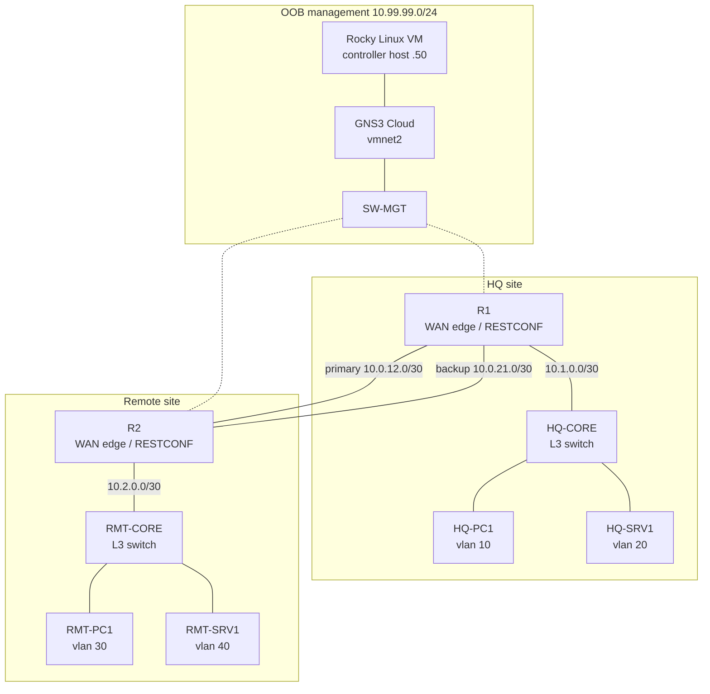
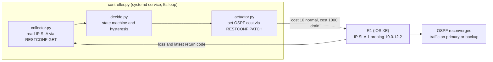
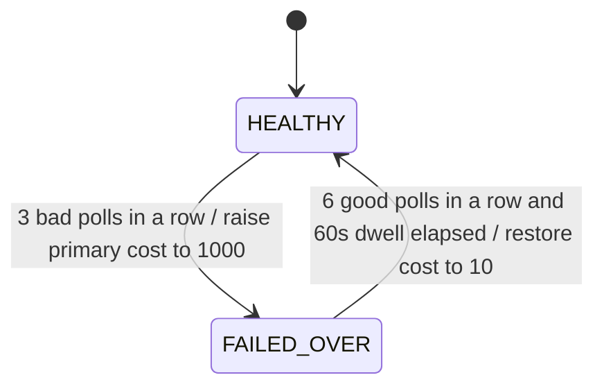

# Closed Loop WAN Failover Automation
 
A self healing dual WAN lab. A Python service running on a Rocky Linux host watches the quality of a primary WAN link, and when that link degrades it automatically drains traffic onto a backup link by reprogramming the router's OSPF cost over RESTCONF. Once the primary link is proven stable again, it moves traffic back. No human touches the CLI.
 
I built this because the manual version of this exact task was part of my day job. When a transport link started flapping in the field, I would log into the routers and retune routing metrics by hand to keep users off the bad path. This project takes that judgment and turns it into a control loop that does it on its own.
 
## What this project does
 
The system runs a continuous loop: measure the link, decide whether it is healthy, and act if it is not.
 
1. The router measures its own primary WAN link using IP SLA (a small ICMP probe it fires every few seconds).
2. A Python service reads those measurements from the router over RESTCONF.
3. A state machine decides whether the link is healthy or degraded, using logic designed so that brief blips do not trigger anything and so the automation itself never oscillates.
4. If the link is degraded, the service raises the OSPF cost on the primary interface over RESTCONF. OSPF reconverges and traffic shifts to the backup path. If the link recovers and stays good, it restores the cost and traffic returns.
The interesting engineering is not the loop itself. It is the safety logic wrapped around it, which I explain in the decision logic section below.
 
## Why the design is shaped this way
 
The whole point of a failover tool is stability, so the worst possible failure mode is a tool that causes the very flapping it is supposed to prevent. Everything in the decision logic exists to prevent that. Brief degradations are ignored. A recovery has to last a while before the tool trusts it. Config changes are written in a way that is safe to repeat. That discipline is what separates this from a simple "if bad then change config" script.
 
## Lab topology
 
The lab is two sites joined by two WAN paths, built entirely inside GNS3 with a Rocky Linux virtual machine bridged in to run the automation.
 

 
 
Two sites. HQ on the left, Remote on the right. Each site has a WAN edge router (R1, R2) and a layer 3 switch (HQ-CORE, RMT-CORE) that handles routing between the user and server VLANs over switched virtual interfaces. End hosts live in real VLANs. The two routers are joined by a primary and a backup link. Management is out of band: a separate switch (SW-MGT) connects both routers and the Rocky VM through a GNS3 Cloud node bound to a VMware vmnet, so the automation reaches the routers without touching the data plane.
 
The logical version of the same topology:
 

 
### Addressing plan
 
| Network | Purpose | Devices |
|---|---|---|
| 10.99.99.0/24 | Out of band management | R1 Gi3 .11, R2 Gi3 .12, Rocky VM .50 |
| 10.0.12.0/30 | Primary WAN (the monitored link) | R1 Gi1 .1, R2 Gi1 .2 |
| 10.0.21.0/30 | Backup WAN | R1 Gi2 .1, R2 Gi2 .2 |
| 10.1.0.0/30 | R1 to HQ-CORE uplink | R1 Gi4 .1, HQ-CORE Eth0/1 .2 |
| 10.2.0.0/30 | R2 to RMT-CORE uplink | R2 Gi4 .1, RMT-CORE Eth1/1 .2 |
| 192.168.10.0/24 | HQ users, vlan 10 | gateway HQ-CORE .1, HQ-PC1 .100 |
| 192.168.20.0/24 | HQ servers, vlan 20 | gateway HQ-CORE .1, HQ-SRV1 .100 |
| 192.168.30.0/24 | Remote users, vlan 30 | gateway RMT-CORE .1, RMT-PC1 .100 |
| 192.168.40.0/24 | Remote servers, vlan 40 | gateway RMT-CORE .1, RMT-SRV1 .100 |
 
OSPF area 0 runs on both routers and both core switches. The host facing switched virtual interfaces (vlan 10, 20, 30, 40) are set passive in OSPF, so the subnets are advertised but the switches send no hellos toward the access ports. The routers have nothing passive because every routing interface on them peers with another router. Normal primary cost is 10 and backup cost is 50, so OSPF prefers the primary by default. The automation raises the primary cost to 1000 to force a failover and sets it back to 10 to recover.
 
## How the pieces work together
 
The automation is five small Python files. Four do one job each and one ties them together. Keeping them separate is deliberate: the decision logic touches nothing on the network, which means I can test all the tricky failover behavior on my laptop with the lab turned off.
 

 
`probe.py` is the throwaway first script. Its only job was to prove I could authenticate to the router over RESTCONF and pull back the raw IP SLA JSON so I could read its structure. It is not part of the running system, but it is in the repo because it is how I discovered the actual field names my IOS XE version uses. Reading the live JSON instead of trusting a blog is the habit that saved me later.
 
`collector.py` reads the IP SLA operational data over RESTCONF and reduces it to the few numbers the rest of the system needs: a loss percentage, the round trip time, and the latest probe return code. It hides all of the YANG and JSON details so nothing downstream has to care about them. It is also where the most important bug fix lives (see the loss calculation story below).
 
`decide.py` is the brain and it is pure logic. It imports nothing that talks to the network. You feed it one poll's worth of metrics and it returns one of three decisions: do nothing, fail over, or revert. It holds the current state and the streak counters between calls. Because it is pure, the file ships with its own unit tests that prove the failover and anti flap behavior without any lab running at all.
 
`actuator.py` writes the OSPF cost back to the router with a RESTCONF PATCH. It returns true or false instead of throwing, so the controller can decide what to do when a write fails. Writing one leaf with PATCH means re applying the same value is harmless, which matters in a loop.
 
`controller.py` is the service. It runs the loop every five seconds, calls the collector, hands the metrics to the decision logic, and when a decision comes back it calls the actuator with retries. It logs every cycle so the whole thing leaves an audit trail. It runs under systemd and logs to the journal.
 
## The decision logic
 
There are two states, HEALTHY and FAILED_OVER, and the transitions between them are intentionally hard to trigger.
 

 
A single poll is judged bad if loss crosses a threshold, or round trip time crosses a threshold, or the router cannot be read at all (an unreadable router is treated as a degraded link, not a crash).
 
The reason this does not flap comes down to three ideas working together.
 
The first is hysteresis. It takes three bad polls in a row to fail over, but six good polls in a row to even consider reverting. The bar to leave a state is higher than the bar to enter it, so the system settles instead of bouncing.
 
The second is a dwell timer. Even after the primary looks healthy again, the system refuses to revert until at least sixty seconds have passed since the failover. This stops a link that recovers and immediately degrades again from yanking traffic back and forth.
 
The third is graceful draining instead of a hard cut. The tool raises the OSPF cost rather than shutting the interface down. OSPF then makes the routing decision the way it is designed to. The path is never torn away, it just becomes unattractive, so traffic drains cleanly to the backup.
  
## Running the demo
 
The demo that proves it works is a host to host traceroute that visibly changes path while the link degrades, with connectivity never dropping.
 
This first screenshot confirms that RESTCONF returns the router hostname over TLS:
 

 
 
The router's IP SLA is up and logging successes on a clean link:
 

 
The decision logic passes its own tests with the lab off:
 

On a clean link, traffic crosses the primary WAN:
  

I then injected 80% packet loss on the primary link in GNS3 and the service fails over. The same traceroute now crosses the backup WAN, and the host never lost reach:
 

 

The proof is the service log. It shows the state, the live metrics, and the moment it decided to fail over and later to revert, all with timestamps:
 
Failed to backup link:

 
Reverted back to primary link:

 
## Problems I hit and how I solved them
 
 
### TLS would not even handshake
 
The first curl to the router failed with a TLS handshake failure before authentication ever ran. That told me the network path was fine and the two sides simply could not agree on terms. The cause was that my Rocky Linux 10 host enforces a modern crypto policy that rejects old signature algorithms, and the router was presenting a temporary certificate it had generated on its own, signed with SHA1. The `-k` flag did not help because that only skips trust checks, not the rejection of a weak signature algorithm. The real fix was to give the router a proper SHA256 certificate with a 2048 bit key, rather than weakening the host.
 
### The certificate refused to generate
 
Generating that certificate then failed twice for two different reasons. First the router kept reusing a 1024 bit key even after I asked for 2048, so I had to zeroize the key, regenerate it, and verify the size by actually reading the modulus rather than trusting the command output. Second, even with a good key, enrollment failed with the message "validity period start later than end." Turning on the PKI debug showed the router was stamping the certificate's start date after its end date. The old router image had a hardcoded maximum certificate date that fell before the lab's 2026 clock, so the validity window came out inverted. The fix was counterintuitive: roll the router's clock back to an earlier year, generate the certificate there, then roll the clock forward again. The certificate dates do not matter to my clients because they skip expiry checks in the lab, so all I needed was for generation to succeed.

 
## Tech stack
 
Python with the requests library for the automation. RESTCONF over HTTPS with YANG modeled data for talking to the routers. Cisco IOS XE routers and IOSvL2 layer 3 switches in GNS3, with VPCS for end hosts. OSPF for routing and IP SLA for link measurement. A Rocky Linux 10 virtual machine in VMware Workstation, bridged into GNS3 through a Cloud node and a vmnet, running the service under systemd and logging to journald. The whole lab and host run on a single Linux Mint laptop.
